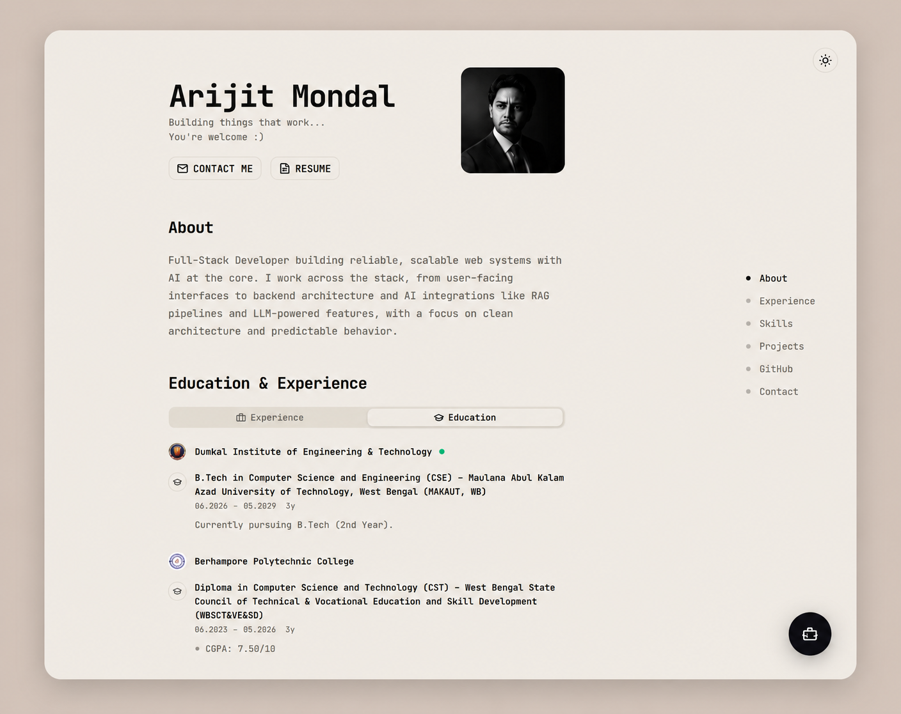

<div align="center">

# Portfolio

A data-driven personal portfolio for **Arijit Mondal**, a full-stack developer
building modern, scalable web applications with React, Next.js, TypeScript,
Node.js, and AI-powered technologies.


</div>

<div align="center">
  
</div>

## 📑 Table of Contents

- [✨ Features](#features)
- [🛠️ Tech Stack](#tech-stack)
- [🚀 Getting Started](#getting-started)
- [📁 Project Structure](#project-structure)
- [📜 Scripts](#scripts)
- [☁️ Deployment](#deployment)
- [🎨 Customization](#customization)

## ✨ Features

- 👤 **Hero + About** — Name, tagline, avatar, and bio with CTA links to contact
  and a resume dialog that embeds the PDF.
- 🎓 **Education & Experience** — Tabbed timeline component showing work history
  and academic background, each entry with date range, description, and tech
  tags.
- 🛠️ **Skills** — Categorized auto-scrolling marquees of skill badges with brand
  icons (Languages, Frontend, Backend, Database, Cloud & Tools).
- 🗂️ **Projects** — Card grid previewing 2 featured projects on the home page with
  a dedicated `/projects` page listing all 6 projects (demo and source links).
- 📊 **GitHub Contributions** — Yearly contribution heatmap fetched server-side
  through TanStack Query and proxied from the GitHub Contributions API.
- 📬 **Contact Form** — Validated form (react-hook-form + Zod) that sends email
  via nodemailer (SMTP) through Inngest. Social links (GitHub, LinkedIn, X/Twitter, Email, Phone)
  displayed alongside the form.
- 🌓 **Dual Theme** — Light and dark mode with system preference detection and an
  animated circular-reveal transition via the View Transitions API.
- 🎬 **Motion Animations** — Scroll-triggered reveals, staggered child entrances,
  auto-scrolling marquees, and route-transition fades powered by motion v12.
- ⏳ **Loading Splash** — Full-viewport overlay that gates entrance animations until
  dismissed, and is auto-skipped for returning visitors and reduced-motion users, so
  scroll/route reveals never play behind it.
- 🔍 **SEO** — Dynamic sitemap (`/sitemap.xml`), robots.txt, Open Graph image, and
  canonical metadata generated from data files.
- 🤖 **AI Chatbot** — Embedded SupportAI chatbot on every page for interactive
  assistance.
- 📱 **Responsive** — Single-column centered layout with a sticky footer, adapts
  to all screen sizes.
- 🗃️ **Data-Driven** — All content lives in `src/data/` — edit the data files to
  update copy, skills, projects, and links without touching components.

## 🛠️ Tech Stack

### ⚛️ Framework & Language

|                |                                                 |
| -------------- | ----------------------------------------------- |
| **Framework**  | [Next.js 16](https://nextjs.org/) (App Router)  |
| **UI Library** | [React 19](https://react.dev/)                  |
| **Language**   | [TypeScript 5](https://www.typescriptlang.org/) |
| **Font**       | JetBrains Mono via `next/font`                  |

### 🎨 UI & Styling

|                |                                                                                                                         |
| -------------- | ----------------------------------------------------------------------------------------------------------------------- |
| **CSS**        | [Tailwind CSS v4](https://tailwindcss.com/) (CSS-first config, `@theme inline` in `globals.css`)                        |
| **Components** | [shadcn/ui](https://ui.shadcn.com/) (base-nova, on [@base-ui/react](https://base-ui.com/))                              |
| **Icons**      | [react-icons](https://react-icons.github.io/react-icons/) (FA6 brands) + [lucide-react](https://lucide.dev/) (UI icons) |
| **Animation**  | [motion v12](https://motion.dev/) (formerly Framer Motion)                                                              |

### 🔄 State & Data

|                   |                                                                                  |
| ----------------- | -------------------------------------------------------------------------------- |
| **Data Fetching** | [TanStack Query v5](https://tanstack.com/query)                                  |
| **Theme**         | [next-themes](https://github.com/pacocoursey/next-themes) (class-based)          |
| **Forms**         | [react-hook-form](https://react-hook-form.com/) + [Zod](https://zod.dev/)        |
| **Toasts**        | [sonner](https://sonner.emilkowalski.com/)                                       |
| **GH Heatmap**    | [react-activity-calendar](https://github.com/grubersjoe/react-activity-calendar) |

### ⚙️ Backend & Infrastructure

|             |                                                     |
| ----------- | --------------------------------------------------- |
| **Email**   | nodemailer (SMTP) via Inngest (`POST /api/contact`) |
| **Chatbot** | SupportAI embedded script                           |

### 🔧 Tooling

|                     |                                                           |
| ------------------- | --------------------------------------------------------- |
| **Package Manager** | pnpm 11.5.1 (pinned via `packageManager`)                 |
| **Linting**         | ESLint v9 (flat config)                                   |
| **Formatting**      | Prettier 3 + `prettier-plugin-tailwindcss`                |
| **Git Hooks**       | Husky 9 + lint-staged + commitlint (conventional commits) |
| **Node**            | `>=20.9` (`.nvmrc` pins Node 24)                          |

## 🚀 Getting Started

```bash
# 1. Install dependencies
pnpm install

# 2. Set up environment variables
cp .env.example .env.local   # then fill in the values

# 3. Start the development server
pnpm dev                     # → http://localhost:3000
```

> ⚠️ Requires **Node >= 20.9** and **pnpm**. The project enforces both via
> `engine-strict=true` in `.npmrc` and will refuse to install on a mismatched
> version.

### 🔐 Environment Variables

| Variable               | Required | Description                                                                                   |
| ---------------------- | -------- | --------------------------------------------------------------------------------------------- |
| `SMTP_HOST`            | Yes      | SMTP server hostname for the contact form (`/api/contact`).                                   |
| `SMTP_PORT`            | Yes      | SMTP server port (e.g. 587 or 465).                                                           |
| `SMTP_USER`            | Yes      | SMTP authentication username.                                                                 |
| `SMTP_PASS`            | Yes      | SMTP authentication password.                                                                 |
| `SMTP_FROM`            | Yes      | Sender address for outgoing contact emails (nodemailer `from`).                               |
| `INNGEST_DEV`          | No       | Set to `1` to enable the Inngest dev server for local email testing. Run with `pnpm inngest`. |
| `CONTACT_TO_EMAIL`     | No       | Recipient address for contact messages; falls back to `SMTP_FROM` when unset.                 |
| `NEXT_PUBLIC_SITE_URL` | No       | Canonical site URL — used by the sitemap, robots.txt, and SEO metadata.                       |

## 📁 Project Structure

```
src/
├── app/
│   ├── api/
│   │   ├── contact/          POST /api/contact (Inngest + nodemailer SMTP)
│   │   ├── contributions/    GET /api/contributions (GH heatmap proxy)
│   │   └── inngest/          GET/POST/PUT /api/inngest (Inngest functions webhook)
│   ├── projects/             /projects — full project listing page
│   ├── globals.css           Tailwind v4 theme + base styles
│   ├── layout.tsx            Root layout (header, footer, providers, chatbot)
│   ├── opengraph-image.tsx   Dynamic OG image (next/og)
│   ├── page.tsx              Home page — composes all sections
│   ├── providers.tsx         ThemeProvider + QueryClientProvider + MotionConfig
│   ├── robots.ts             /robots.txt
│   ├── sitemap.ts            /sitemap.xml
│   └── template.tsx          Route transition animation (fade in)
├── components/
│   ├── contact/              ContactForm component
│   ├── layout/               SiteHeader, Footer, Section, SectionNav
│   ├── loading/              LoadingScreen + LoadingGate (splash overlay)
│   ├── motion/               Reveal, Stagger, Marquee animation wrappers
│   ├── projects/             ProjectCard + ProjectGrid (shared card grid)
│   ├── sections/             Hero, About, Skills, Projects, Contributions,
│   │                         Contact, EducationExperience
│   ├── theme/                ThemeToggle
│   ├── timeline/             Timeline component
│   ├── ui/                   shadcn/ui primitives (button, card, dialog, …)
│   └── resume-dialog.tsx     Resume modal (embedded PDF preview)
├── data/
│   ├── profile.ts            Name, tagline, bio, avatar, resume link
│   ├── projects.ts           Project list (title, desc, image, demo/source URLs)
│   ├── skills.ts             Skill groups with brand icons
│   ├── socials.ts            Contact links (GitHub, LinkedIn, X, Email, Phone)
│   ├── timeline.ts           Experience + education entries
│   └── github.ts             GitHub username
├── inngest/
│   ├── client.ts             Inngest client
│   └── functions.ts          sendEmailProcess (triggered by app/email.send)
├── lib/
│   ├── date.ts               Date formatting helpers
│   ├── motion.ts             Shared animation constants and variants
│   ├── site.ts               Canonical site URL
│   ├── utils.ts              cn() utility (clsx + tailwind-merge)
│   └── validations.ts        Zod schema for the contact form
└── services/
    └── mailer.service.ts     nodemailer SMTP transporter + sendEmail

public/
├── demo.png                  README demo screenshot
├── favicon.png
├── loading.gif               Loading splash animation
├── profile.png               Avatar image
├── resume.pdf                Downloadable resume
├── logos/                    Institution/company logos (3)
└── projects/                 Project thumbnail images (6)
```

> 📝 Content is **data-driven** — edit the files in `src/data/` to update copy,
> skills, projects, and links rather than touching components.

## 📜 Scripts

| Command             | Description                                   |
| ------------------- | --------------------------------------------- |
| `pnpm dev`          | Start the development server (port 3000)      |
| `pnpm inngest`      | Run the Inngest dev server (local email flow) |
| `pnpm build`        | Production build                              |
| `pnpm start`        | Run the production build                      |
| `pnpm lint`         | Run ESLint                                    |
| `pnpm typecheck`    | Run TypeScript type checking (`tsc --noEmit`) |
| `pnpm format`       | Format all files with Prettier                |
| `pnpm format:check` | Check formatting (CI-friendly)                |

## ☁️ Deployment

The project builds with `pnpm build` and is ready for deployment on
[Vercel](https://vercel.com/):

1. 📤 Push the repository to GitHub.
2. 📥 Import the repo into Vercel.
3. 🔑 Set the environment variables (`SMTP_HOST`, `SMTP_PORT`, `SMTP_USER`,
   `SMTP_PASS`, `SMTP_FROM`, `CONTACT_TO_EMAIL`, `NEXT_PUBLIC_SITE_URL`) in the
   Vercel dashboard.
4. 🚀 Deploy.

> **TODO:** A live demo URL is not confirmed. The canonical site URL defaults
> to `https://arijit-mondal.vercel.app` when unset — set `NEXT_PUBLIC_SITE_URL`
> in your production environment to enable correct SEO metadata.

## 🎨 Customization

1. 🖼️ Replace `public/profile.png` with your own avatar.
2. 📄 Replace `public/resume.pdf` with your own resume.
3. 🔗 Update `src/data/socials.ts` with your LinkedIn, X, and other handles.
4. 🗂️ Update `src/data/projects.ts` with your real project links and replace
   thumbnail images in `public/projects/`.
5. 💼 Update `src/data/timeline.ts` with your own experience and education.
6. 🛠️ Update `src/data/skills.ts` to add or remove skill entries.
7. ✏️ Update `src/data/profile.ts` to change the name, tagline, and bio.
